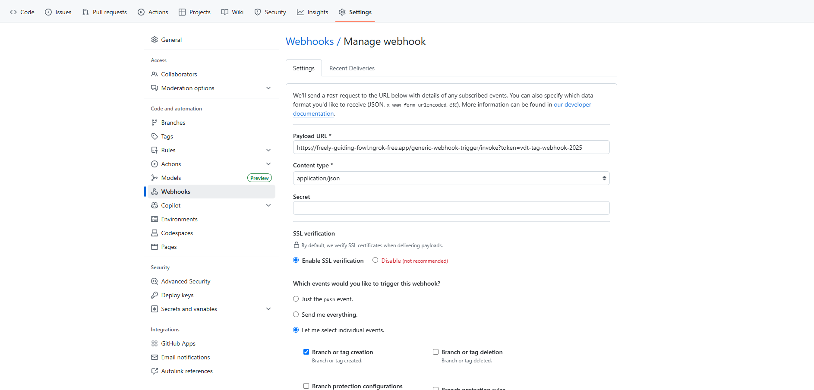
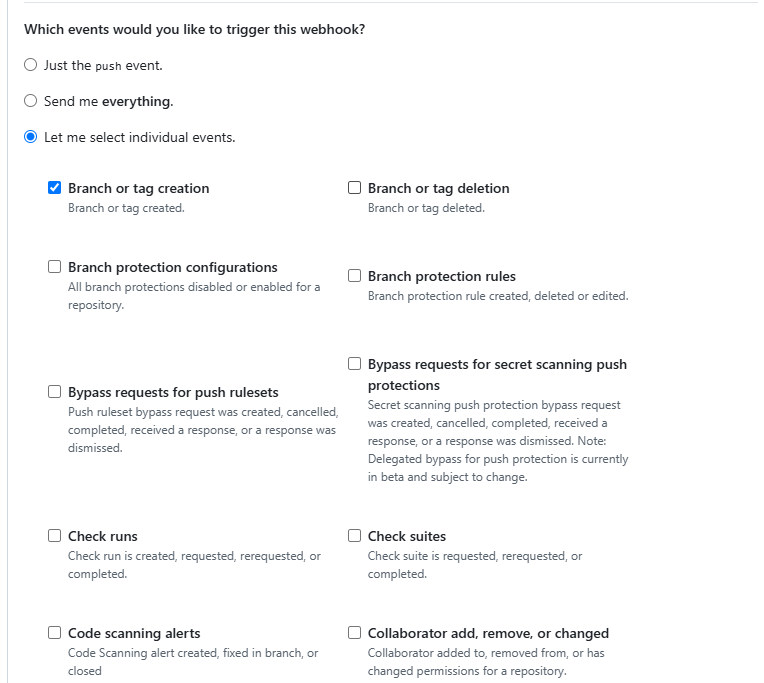
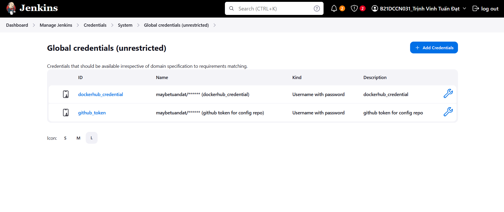
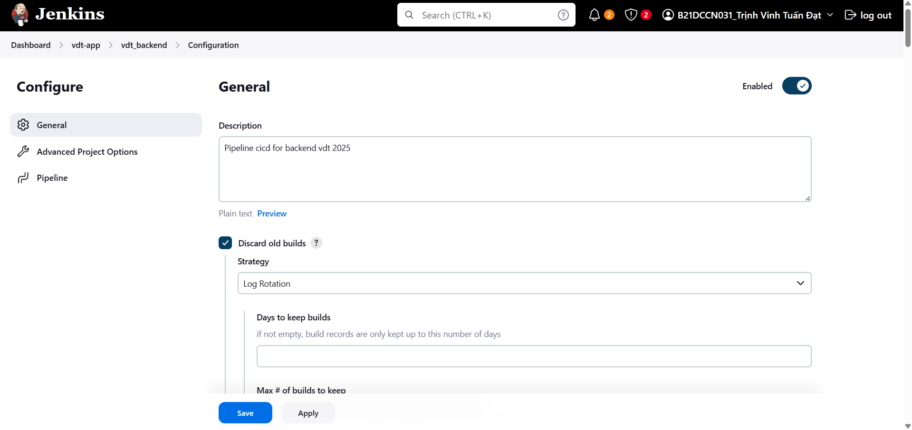
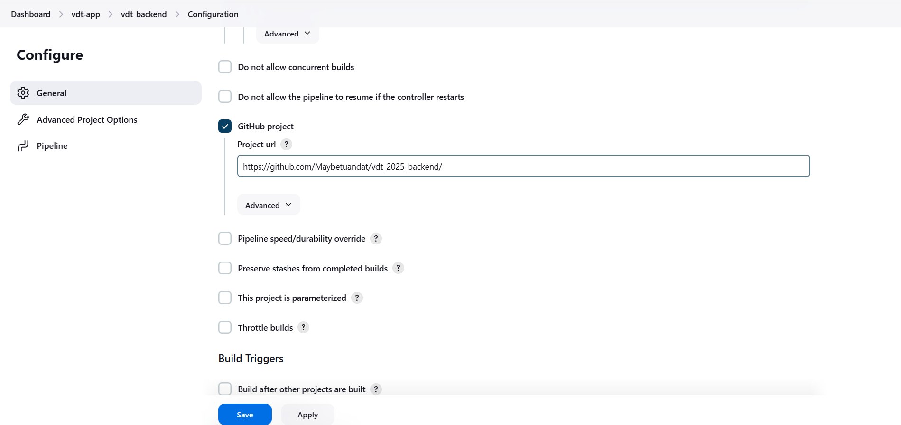
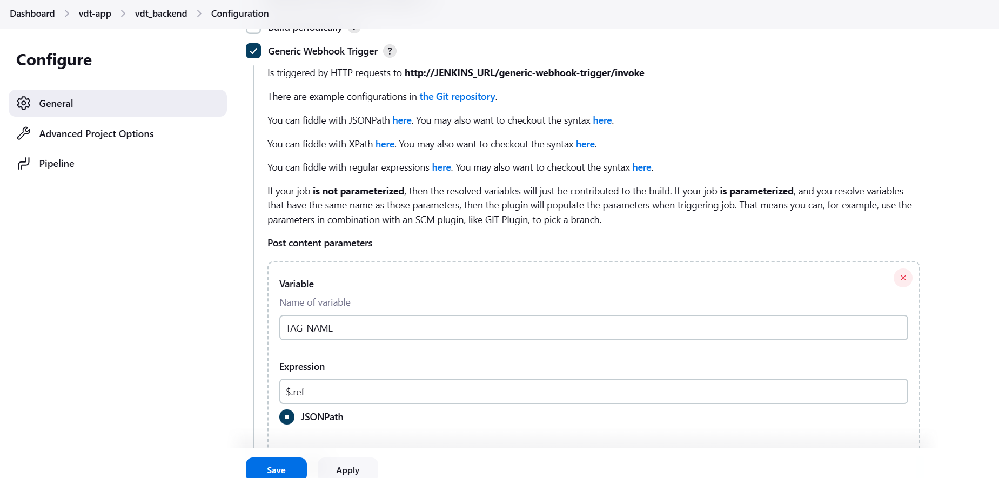
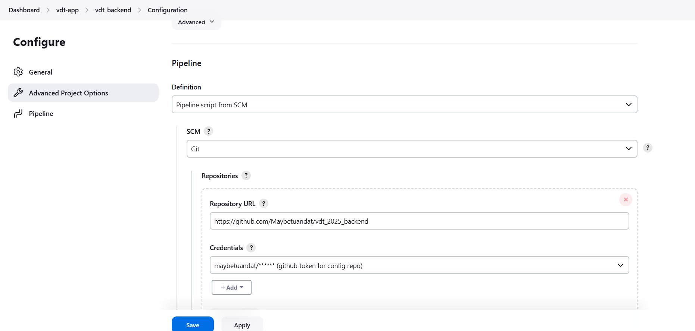
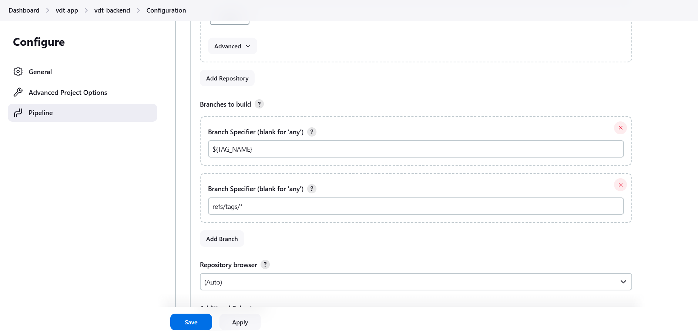

# CI/CD (1.5đ)

## Yêu cầu:

Viết 1 luồng CI/CD cho app, khi có thay đổi từ source code, 1 tag mới được tạo ra trên repo này thì luồng CI/CD tương ứng của repo đó thực hiện các công việc sau:

- Sửa code trong source code
- Thực hiện build source code trên jenkin bằng docker với image tag là tag name đã được tạo ra trên gitlab/github và push docker image sau khi build xong lên Docker Hub
- Sửa giá trị Image version trong file values.yaml trong config repo và push thay đổi lên config repo.
- Cấu hình ArgoCD tự động triển khai lại web Deployment và api Deployment khi có sự thay đổi trên config repo.

## Output:

- Các file setup công cụ của luồng CI/CD
- Output log của luồng CI/CD khi tạo tag mới trên repo app
- Show log chứng minh jenkin đã chạy đúng
- Jenkin file cấu hình các luồng
- Ảnh luồng CI/CD chạy qua các stage trên giao diện Jenkins (sử dụng Plugin Pipeline Stage View)
- Hình ảnh app triển khai argoCD, hình ảnh diff khi argoCD phát hiện thay đổi ở config repo tương tự hình ảnh sau
- Hình ảnh app trước khi sửa code và sau khi sửa code.

## Kịch bản triển khai CI/CD
1. Cấu hình webhook trên github repo chứa source code, khi có event tạo tag mới, webhook sẽ gửi một request về cho jenkins 
2. Jenkins nhận request và thực hiện chạy pipeline CI
3. Jenkins sẽ tạo image từ source code trên repo github, build image và push  images này lên docker hub
4. Jenkins thực hiện sửa tag của images trong file values-prod.yaml và push code lên repo config
5. ArgoCD mặc định cấu hình 3 phút / lần polling thay đổi trên repo config, nếu có sự khác biệt sẽ thực hiện tự động deploy lại trên cụm k8s

# 1. Cấu hình luồng CI/CD cho backend

## Thiết lập truy cập Jenkins

Do Jenkins được triển khai trên cụm Kubernetes và chỉ có thể truy cập qua NodePort, cần sử dụng một giải pháp tunneling để có thể truy cập từ bên ngoài:

**Sử dụng Ngrok để tạo public endpoint:**
- **Public URL**: `https://freely-guiding-fowl.ngrok-free.app/`
- **Forward đến**: `192.168.122.93:30999` (NodePort của Jenkins service)
- **Mục đích**: Cho phép GitHub webhook có thể gọi đến Jenkins để trigger CI/CD pipeline

**Lệnh khởi tạo Ngrok:**
```bash
nohup ngrok http --url=freely-guiding-fowl.ngrok-free.app 192.168.122.93:30999 &
```


## 1.1 Cấu hình GitHub Webhook

### Cấu hình URL webhook GitHub



### Cấu hình event GitHub



Webhook URL: https://freely-guiding-fowl.ngrok-free.app/generic-webhook-trigger/invoke?token=vdt-tag-webhook-2025

---

## 1.2 Cấu hình Jenkins CI

### Thêm credentials vào Jenkins

Thực hiện thêm credetial vào Jenkins:

| Credential ID | Mô tả |
|---------------|-------|
| **dockerhub_credential** | Là thông tin tài khoản docker hub - nhằm mục đích push image lên docker hub |
| **github_token** | Là thông tin tài khoản github nhằm mục đích xác thực với github và push code lên repo config |


### File cấu hình CI cho Jenkins: Jenkinsfile
[Jenkinsfile](https://github.com/Maybetuandat/vdt_2025_backend/blob/main/Jenkinsfile)


### Tạo Jenkins Job mới
Tạo một item và đặt tên là **vdt_backend**



### Cấu hình Build Retention
**Discard old builds:** Giữ lại 5 bản build cuối cùng để tiết kiệm dung lượng storage

### Cấu hình GitHub Repository
Kết nối với repository GitHub chứa source code backend



### Thiết lập Build Triggers
Cấu hình các tham số để tự động trigger build khi có thay đổi



### Cấu hình Pipeline Script
Chỉ định sử dụng Jenkinsfile từ SCM (Source Code Management)



### Cấu hình Build khi có Tag mới
Pipeline sẽ được trigger tự động khi có tag mới được tạo trên repository



### Chỉ định đường dẫn Jenkinsfile
Xác định vị trí file Jenkinsfile trong repository 
