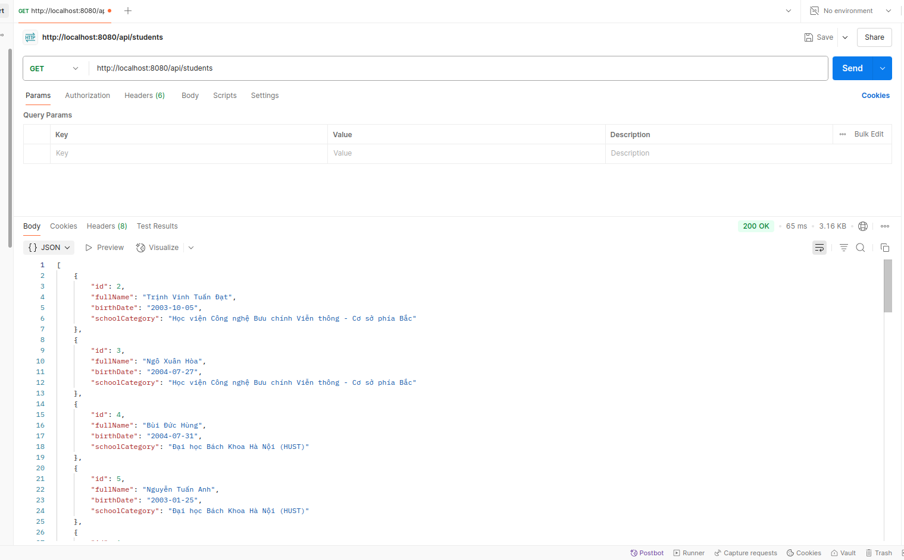

# Triển khai Web Application sử dụng các DevOps Tools & Practices

## Tổng quan
Triển khai web application sử dụng các DevOps tools & practices. Sinh viên chọn 1 app bất kỳ theo cấu trúc microservices (ví dụ web app và api service).

### Ứng dụng được lựa chọn
Giao diện webapp được lựa chọn: Hiển thị danh sách sinh viên tham gia chương trình VDT 2025 lĩnh vực Cloud với công nghệ cốt lõi sử dụng:

#### Kiến trúc hệ thống:
- **Service Backend**: Spring Boot 
- **Service Frontend**: React Vite JS 
- **Database**: PostgreSQL

### Demo ứng dụng

#### Frontend Interface

**Hiển thị danh sách sinh viên:**


**Thêm sinh viên mới:**


**Xóa sinh viên:**


**Tìm kiếm theo tên:**


#### Backend API

**API lấy danh sách sinh viên:**



#### Database

**PostgreSQL Database:**


---

## K8S Helm Chart (1.5đ)

### Yêu cầu 1

#### Nhiệm vụ:
- Cài đặt ArgoCD lên Kubernetes Cluster, expose được ArgoCD qua NodePort
- Cài đặt Jenkins lên Kubernetes Cluster, expose được Jenkins qua NodePort

#### Output 1:

### Cài đặt ArgoCD lên Kubernetes Cluster

Thực hiện cài đặt theo tài liệu: https://argo-cd.readthedocs.io/en/stable/getting_started/

#### Install ArgoCD

```bash
kubectl create namespace argocd
kubectl apply -n argocd -f https://raw.githubusercontent.com/argoproj/argo-cd/stable/manifests/install.yaml
```

**File Manifest cài đặt ArgoCD:** [File Manifest cài đặt Argocd](./manifest/install-argocd.yaml)

#### Expose ArgoCD qua NodePort

File Manifest triển khai dịch vụ ArgoCD qua NodePort (nodePort: 30000):

```yaml
# argocd-service.yaml
apiVersion: v1
kind: Service
metadata:
  name: argocd-server-nodeport
  namespace: argocd
spec:
  type: NodePort
  ports:
    - port: 80
      targetPort: 8080
      nodePort: 30000
  selector:
    app.kubernetes.io/name: argocd-server
```

#### Truy cập ArgoCD

Truy cập ArgoCD qua đường dẫn: **https://192.168.122.93:30000/**

Trong đó:
- `192.168.122.93` là NodeIP
- `30000` là NodePort của ArgoCD

#### Giao diện ArgoCD


---

### Cài đặt Jenkins lên Kubernetes Cluster

#### Install Jenkins

```bash
kubectl create namespace jenkins
kubectl apply -f jenkins.yaml
```

**File Manifest cài đặt Jenkins:** [File Manifest cài đặt Jenkins](./manifest/jenkins.yaml)

#### Truy cập Jenkins

Truy cập Jenkins qua đường dẫn: **http://192.168.122.93:30999/**

Trong đó:
- `192.168.122.93` là NodeIP  
- `30999` là NodePort của Jenkins

#### Giao diện Jenkins


---

### Yêu cầu 2

#### Nhiệm vụ:
- Viết hoặc tìm mẫu Helm Chart cho app bất kỳ, để vào 1 folder riêng trong repo app
- Tạo Repo Config cho app trên, trong repo này chứa các file values.yaml với nội dung của các file values.yaml là các config cần thiết để chạy ứng dụng trên k8s bằng Helm Chart

#### Output 2:
- **Các Helm Chart** sử dụng để triển khai app lên K8S Cluster
- **Các file values.yaml** trong config repo của app  
- **Manifest của ArgoCD Application**
- **Ảnh chụp giao diện** màn hình hệ thống ArgoCD trên trình duyệt
- **Ảnh chụp giao diện** màn hình trình duyệt khi truy cập vào Web URL, API URL